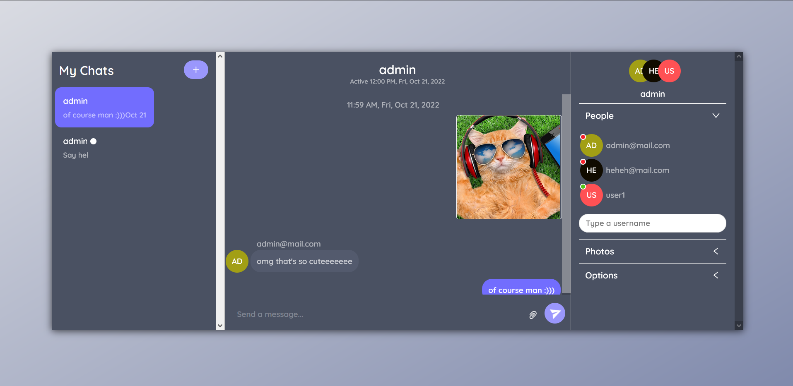
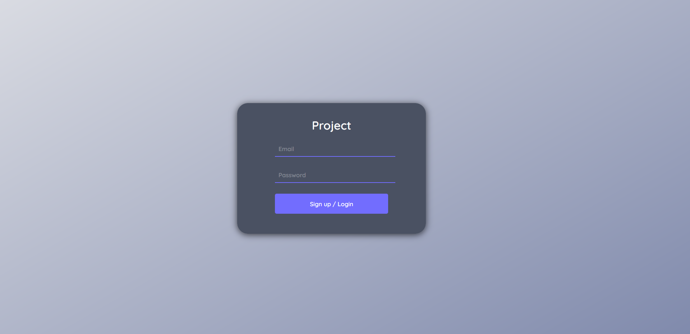

# Simple chat app

## NextJS pet-project

Simple chat app using some React, some NextJS, some ChatEngine

- <code>context</code> - React context (as username and password);
- <code>pages</code> - pages;

## Used technologies

- JavaScript
- ReactJS
- NextJS
- ChatEngine
- Axios

## Screenshots

 
